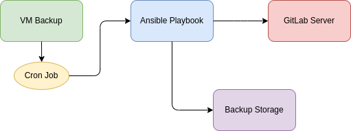

# Backup GitLab with Ansible

This project automates the backup of a GitLab instance using Ansible. A cron job on a virtual machine (VM) executes the Ansible playbook that performs the backup, transfers the archived data to a backup storage location, and sends an email notification upon successful completion.

## Architecture



### Explanation

1. **VM Backup**: A virtual machine where a cron job is set up to periodically run the Ansible playbook.
2. **Cron Job**: A scheduled task that triggers the Ansible playbook at specified intervals.
3. **Ansible Playbook**: A set of automated instructions to back up the GitLab server, transfer the backup to the storage, and send an email notification.
4. **GitLab Server**: The source server where GitLab is running and needs to be backed up.
5. **Backup Storage**: The destination storage where the backups are archived for safekeeping.

### Steps

1. **Cron Job Execution**: The cron job on the VM runs the Ansible playbook at scheduled times.
2. **Stop GitLab Services**: The playbook stops GitLab services to ensure data consistency during backup.
3. **Backup GitLab Data**: The playbook creates a compressed archive of the GitLab data.
4. **Start GitLab Services**: The playbook restarts GitLab services after the backup is complete.
5. **Transfer to Backup Storage**: The playbook transfers the backup archive to the specified backup storage.
6. **Send Email Notification**: The playbook sends an email notification after a successful backup and transfer.
7. **Cleanup**: The playbook removes old backups to manage storage space.

### Requirements

- Ansible installed on the VM
- SSH access to the GitLab server and backup storage
- Sufficient permissions to perform backup and transfer operations
- An SMTP server or service for sending email notifications


### Example Cron Job

```cron
0 04 * * 2-6 ansible-playbook -i gitlab_backup/playbook/gitlab-backup.yml
